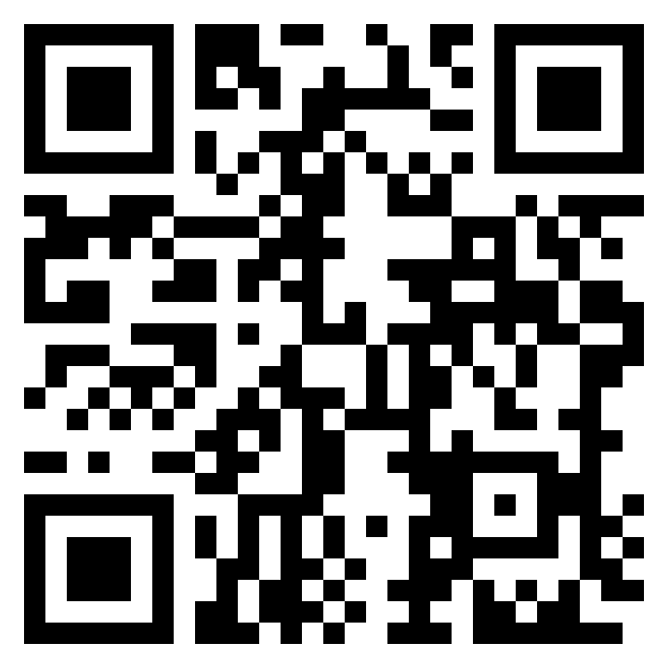
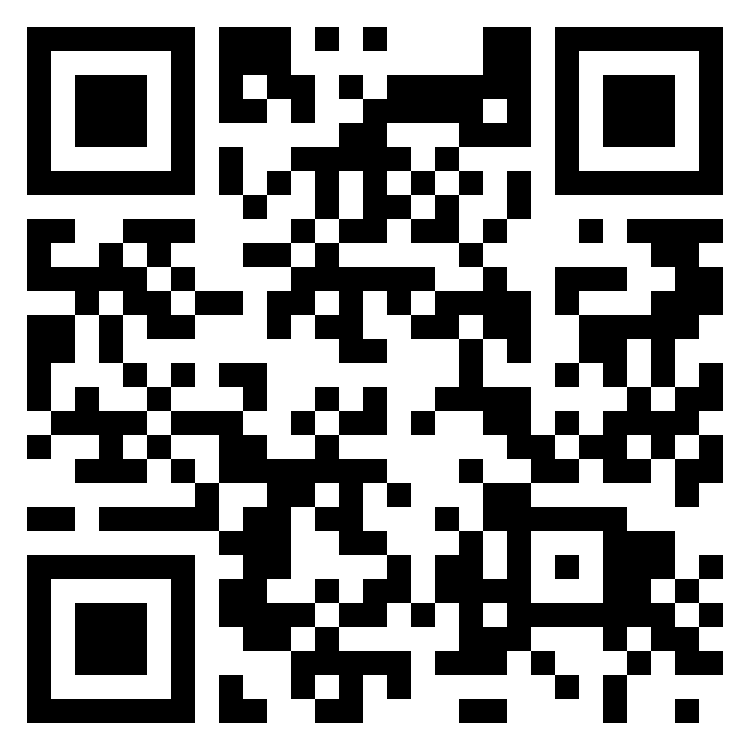

If you enjoy my tools and want to support me, you can donate below.

**Bitcoin (BTC):**

  <button onclick="copy('btc', this)" style="cursor:pointer; font-size: 1.2em; border:none; background:none; padding:0; margin:0;" title="Copy Address">📋</button>
  <code id="btc" style="word-break: break-all;">bc1qzthdgzhdjmqgan5n9c3dp5g3m24sqv30unzxjn</code>

  
Show Bitcoin QR Code

   
  

**Ethereum (ETH):**

  <button onclick="copy('eth', this)" style="cursor:pointer; font-size: 1.2em; border:none; background:none; padding:0; margin:0;" title="Copy Address">📋</button>
  <code id="eth" style="word-break: break-all;">0xda1c45125c3148bef77922225da5936d7777ca0e</code>

  
Show Ethereum QR Code

   
  

**XRP:** (Tag not required. If forced, use 0)

  <button onclick="copy('xrp', this)" style="cursor:pointer; font-size: 1.2em; border:none; background:none; padding:0; margin:0;" title="Copy Address">📋</button>
  <code id="xrp" style="word-break: break-all;">rN3KXnyiZvNFTUkY1Yry5xrx3nyNTMjPPo</code>

  
Show XRP QR Code

   
  

**Solana (SOL):**

  <button onclick="copy('sol', this)" style="cursor:pointer; font-size: 1.2em; border:none; background:none; padding:0; margin:0;" title="Copy Address">📋</button>
  <code id="sol" style="word-break: break-all;">GxUYy9TrK5sKvr8NEYs8QeC1XZ8ZZ8e2xhevYmf83JPu</code>

  
Show Solana QR Code

   
  

**Dogecoin (DOGE):**

  <button onclick="copy('doge', this)" style="cursor:pointer; font-size: 1.2em; border:none; background:none; padding:0; margin:0;" title="Copy Address">📋</button>
  <code id="doge" style="word-break: break-all;">DAHdS4S4tuhPy2HMbboYaTf6unPHQPYyAH</code>

  
Show Dogecoin QR Code

   
  

**Monero (XMR):**

  <button onclick="copy('xmr', this)" style="cursor:pointer; font-size: 1.2em; border:none; background:none; padding:0; margin:0;" title="Copy Address">📋</button>
  <code id="xmr" style="word-break: break-all;">85WaFLhsc6QFR747nCLtmMes7Qhfwd1gkauBxdep3jpGS2KXj7res17LV5myFNR9XNLGeBEeWmmBpibDEVWG3zpWA1xiQzK</code>

  
Show Monero QR Code

   
  

**Litecoin (LTC):**

  <button onclick="copy('ltc', this)" style="cursor:pointer; font-size: 1.2em; border:none; background:none; padding:0; margin:0;" title="Copy Address">📋</button>
  <code id="ltc" style="word-break: break-all;">ltc1qv2etczlwqklcvkh9axt5uruh0r2qjj45s978pp</code>

  
Show Litecoin QR Code

   
  

*Thanks for your support!* [vixkrell@gmail.com](mailto:vixkrell@gmail.com)

